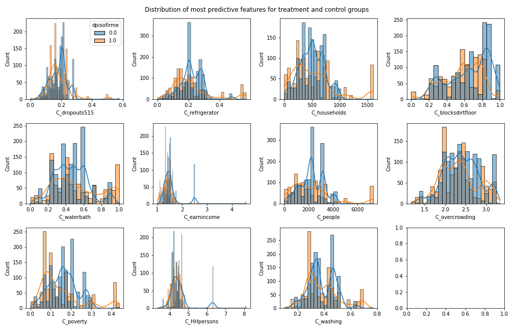
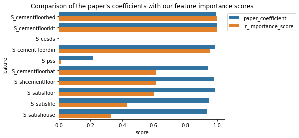

# Task A of our creative extension

Our task A consists in two main goals:
1. Compare the predictive performances of the different _outcome variables_ specified in Tables 4 and 6 of the paper to predict whether a household is from the treatment of control group.

To achieve this, we first build a baseline model that only includes control variables, i.e. features from the 2000 census, and features from the 2005 survey that are used either in their regression model 3 or as robustness checks in Table 7 of the paper. 
50 such features were selected.
The task consists in predicting whether an household is from the treatment or control group based on these features. The target feature is therefore the _intention-to-treat_ feature, referred as `dpisofirme` throughout the code.

Our expectation is that the baseline model should not perform well because the authors provided ample evidences that treatment and control households are well balanced over these control variables. As we will see, our models could actually exploit the differences in these control variables and perform very well on this baseline case.

Then we construct a model for each _outcome variable_, i.e. a model that includes the outcome variable as covariate besides the control variables. 
In the paper, the intention-to-treat variable is shown to be important to predict the outcome variables, hence we expect that including an outcome variable in the model should improve our predictions of the intention-to-treat variable. 
As you will see, we could not observe such an effect because the baseline predictions were already perfect.

2. Compare the feature importances of the _outcome variables_ with the regression coefficients from the paper

To achieve this, we perform a feature importance analysis on the models explained above and obtain an importance score for each outcome variable.
Then we compare first qualitatively the importance ranking of the outcome variables using our importance scores with the ranking based on the paper's regression coefficients.
It turns out that they agree relatively well.
We then compare them quantitatively and they agree pretty well too.

Reference to the [paper](https://www.aeaweb.org/articles?id=10.1257/pol.1.1.75):

Matias D. Cattaneo, Sebastian Galiani, Paul J. Gertler, Sebastian Martinez, and Rocio Titiunik. Housing, health, and happiness. American Economic Journal: Economic Policy, 1(1):75–105, February 2009.

## Comparison of the predictive performances

**Table caption**:

Prediction performances on the test set.
The left-most column represents the outcome variable that is included as covariate, besides the control variables. 
The _baseline_ variable means that only the control variables are included.
Columns 2 to 4 show the accuracy of each classifier.
Columns 5 to 7 show the F1-score of each classifier.
The 3 right-most columns represent the feature importance associated to the feature mentioned in the first column for each classifier.

%% In datastory, display file: figures/classifiers_performances_table.html
| variable         |   accuracy, logistic_regression |   accuracy, random_forest |   accuracy, xgboost |   f1, logistic_regression |   f1, random_forest |   f1, xgboost |   importance_score, logistic_regression |   importance_score, random_forest |   importance_score, xgboost |
|:-----------------|--------------------------------------:|--------------------------------:|--------------------------:|--------------------------------:|--------------------------:|--------------------:|----------------------------------------------:|----------------------------------------:|----------------------------------:|
| S_cementfloorbat |                              0.816697 |                        0.998185 |                  0.99637  |                        0.818018 |                  0.998205 |            0.996403 |                                      1.05474  |                             0.000634676 |                       0.00144596  |
| S_cementfloorbed |                              0.807623 |                        1        |                  0.99637  |                        0.811388 |                  1        |            0.996403 |                                      1.91951  |                             0.0227797   |                       0.0260963   |
| S_cementfloordin |                              0.822142 |                        1        |                  0.99637  |                        0.824373 |                  1        |            0.996403 |                                      1.82454  |                             0.0119714   |                       0.0108324   |
| S_cementfloorkit |                              0.833031 |                        0.998185 |                  0.99637  |                        0.836299 |                  0.998205 |            0.996403 |                                      1.93015  |                             0.0296461   |                       0.127061    |
| S_cesds          |                              0.827586 |                        0.998185 |                  0.998185 |                        0.828829 |                  0.998205 |            0.998205 |                                     -0.350066 |                             0.00214408  |                       0.0011571   |
| S_pss            |                              0.822142 |                        0.998185 |                  1        |                        0.821168 |                  0.998205 |            1        |                                     -0.320535 |                             0.00162651  |                       0.000985811 |
| S_satisfloor     |                              0.831216 |                        0.998185 |                  1        |                        0.831216 |                  0.998205 |            1        |                                      1.01713  |                             0.00287984  |                       0.000337703 |
| S_satishouse     |                              0.814882 |                        0.998185 |                  1        |                        0.814545 |                  0.998205 |            1        |                                      0.394932 |                             0.000276433 |                       0           |
| S_satislife      |                              0.822142 |                        0.998185 |                  1        |                        0.822464 |                  0.998205 |            1        |                                      0.62483  |                             0.000305043 |                       0.000470012 |
| S_shcementfloor  |                              0.820327 |                        0.998185 |                  0.998185 |                        0.825397 |                  0.998205 |            0.998205 |                                      1.05618  |                             0.0429705   |                       0.0940141   |
| baseline         |                              0.818512 |                        1        |                  1        |                        0.817518 |                  1        |            1        |                                               |                                         |                                   |

Impressively, the baseline models, i.e. the models that only uses the control variables, achieve perfect prediction accuracy and F1-score on the test set using the random forest and XGBoost classifiers.

We did not expect this since the authors provide evidence that households selected in the treatment and control groups are similar in all control variables.

We notice that the results of logistic regressions are not bad as well (all models have an accuracy above 0.8) considering that chance accuracy is 0.51.
The fact that the logistic regression classifier still performs poorly compared to the random forest and XGBoost classifiers suggests that the relationship between the variables and the log odds of the treatment/control target is substantially non-linear.

Let's look at the distribution of the features that are considered the most important according to our classifiers.

Here are the features ranked as most important for each classifier:

%% In datastory, display file: figures/coef_and_importance_comparison_table.html
|    | model               | feature      |   feature_importance | model         | feature           |   feature_importance | model   | feature           |   feature_importance |
|---:|:--------------------|:-------------|---------------------:|:--------------|:------------------|---------------------:|:--------|:------------------|---------------------:|
|  0 | logistic_regression | C_people     |             11.145   | random_forest | C_blocksdirtfloor |            0.0686068 | xgboost | C_poverty         |            0.12123   |
|  1 | logistic_regression | C_earnincome |              4.51601 | random_forest | C_waterbath       |            0.0651486 | xgboost | C_waterbath       |            0.0990022 |
|  2 | logistic_regression | C_washing    |              4.43984 | random_forest | C_refrigerator    |            0.0622958 | xgboost | C_overcrowding    |            0.0972884 |
|  3 | logistic_regression | C_HHpersons  |             -3.93245 | random_forest | C_households      |            0.0597152 | xgboost | C_blocksdirtfloor |            0.0886493 |
|  4 | logistic_regression | C_households |             -9.76182 | random_forest | C_washing         |            0.0586357 | xgboost | C_dropouts515     |            0.0816101 |

We note that several features are considered important by several classifiers, such as `C_households`, `C_blocksdirtfloor`, `C_waterbath`.

Note that the feature importance scores from the logistic regression are calculated differently from the ones of the random forest and XGBoost classifiers and their values cannot be compared. We only look at the relative rankings of the features here.

Let's look at the distribution of all the most important features reported in the above table.

%% In datastory, display file: figures/distribution_of_most_important_features_task_A

We see that the distribution for the treatment and control groups are indeed relatively different for these features.
It is remarkable that our classifiers are able to take advantage of these differences to such an extent as to perfectly predict the treatment/control labels on a held-out test set.

## Comparison of our feature importances with their _intention-to-treatment_ coefficients

We now compare the feature importances of the outcome variables obtained in the present task, with the coefficients of the _intention-to-treat_ variable that the authors obtain in their regression analyses.

We expect that our feature importances should loosely agree with their coefficients, meaning that the extent to which the _intention-to-treat_ variable is linearly related to a variable is proportional to the importance of this variable to predict the _intention-to-treat_ variable.

We will use the feature importances from the logistic regression because they range over positive as well as negative values, contrarily to the feature importance scores from random forest and XGBoost classifiers.

**Table caption:**

Features rankings.
The left-most column shows the features ranked by their paper's coefficients. The second column shows the value of the coefficient.
The two right-most columns show the features ranked by their feature importance scores that we computed above, and the value of the scores.

%% In datastory, display file: figures/coef_and_importance_comparison_barplot.html
|    | paper_ranking    |   paper_importance_score | lr_ranking       |   lr_importance_score |
|---:|:-----------------|-------------------------:|:-----------------|----------------------:|
|  0 | S_cesds          |                   -2.315 | S_cesds          |             -0.350066 |
|  1 | S_pss            |                   -1.751 | S_pss            |             -0.320535 |
|  2 | S_satishouse     |                    0.092 | S_satishouse     |              0.394932 |
|  3 | S_cementfloorbat |                    0.105 | S_satislife      |              0.62483  |
|  4 | S_satislife      |                    0.112 | S_satisfloor     |              1.01713  |
|  5 | S_shcementfloor  |                    0.202 | S_cementfloorbat |              1.05474  |
|  6 | S_cementfloordin |                    0.21  | S_shcementfloor  |              1.05618  |
|  7 | S_satisfloor     |                    0.219 | S_cementfloordin |              1.82454  |
|  8 | S_cementfloorbed |                    0.238 | S_cementfloorbed |              1.91951  |
|  9 | S_cementfloorkit |                    0.255 | S_cementfloorkit |              1.93015  |

We first notice that the ranking of importances is almost the same in the paper and in our task:

The only differences are stated in the 3 following bullet points, in which the first rank mentioned corresponds to the paper's, and the second corresponds to our task's:
- `S_satislife` is ranked 4 instead of 3
- `S_shcementfloor` is ranked 5 instead of 6
- `S_satisfloor` is ranked 7 instead of 4

We also note that the sign of the coefficients agree with the sign of the feature importance scores.

We conclude that our feature importance scores agree qualitatively with the coefficients from the paper's regressions.

Here we show the paper's coefficients transformed in the range \[0, 1\], along with the importance scores that we obtained for the same features and transformed in the same way.

**Observations:**
- The scores are almost the same for 3 of the cement related features (`S_cementfloorbed`, `S_cementfloorkit`, `S_cementfloordin`) and for `S_cesds`, the depression score.
- `S_cementfloorbat`, `S_shcementfloor`, `S_satisfloor` have similar values in terms of the paper coefficients, and also in terms of the feature importance scores. But they all are considered relatively less important by the feature importance scores compared to the paper coefficients.
- The feature for which the two scores differ the most (on a relative scale) is `S_pss`, which represents the perceived stress of the mother of the households.

We conclude that our feature importance scores agree to some extent quantitatively with the paper coefficients. 
But we advise not to rely too much on them, and rather only use the qualitative information of the ranking, which is probably more robust.
